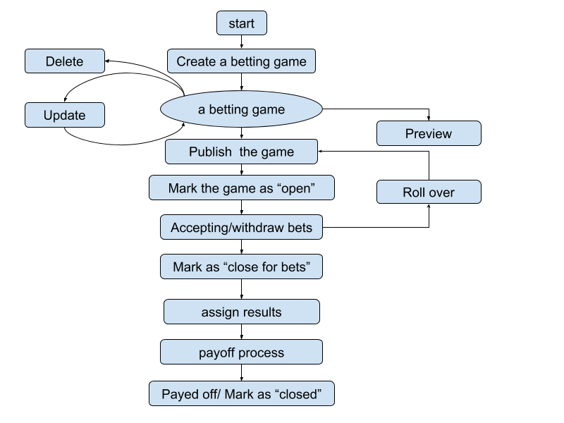
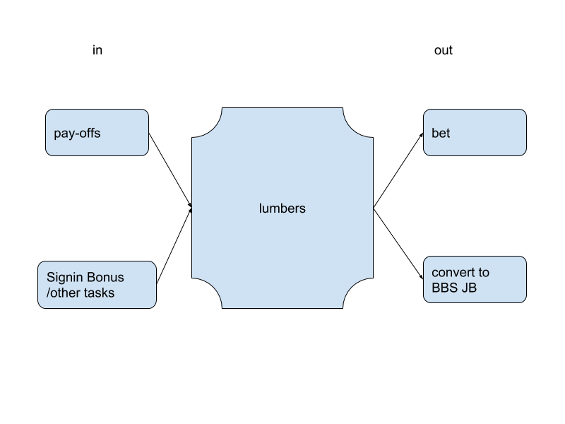

# 业务逻辑

说明：此文档描述的业务逻辑有缺陷，它默认了站点拥有无限的代币。

说明：此文档描述的业务并不完全。

## 单个盘口的流程


## 用户代币的出入图


## 基于use case的业务流程
### Common Requirements
1. If a non-admin user tries to do admin's actions, the server must reject
   with "403 Forbidden";
2. Unauthorized user must be rejected with "401 Unauthorized";
3. Generally the server should ignore the forbidden fields;

### 创建盘口
**Role**: admin

**URL**: games/

**HTTP Verb**: POST

**required field**: *name*, *options*(an option must include *name* and *odds*
at the same time)

**optional fields**: *maximum_bet_options*(allow bet on multiple fields, no
bigger than the number of the options), *end_time_for_bet*,
*time_for_payoff*(this timestamp must be later than the *end_time_for_bet*
field)

**forbidden fields**: *status*, *enrolled*, *winning_option*

**response**:
1. If the game is created, the server should repond with "201 Created" along
   with the game data;
2. If the server failed to create the game, the server should respond with
   "400 Bad Request" and provide a message describing the problem;

example request data:
```json
{
    "name": "2018 TI8淘汰赛 LGD vs OG",
    "description": "TI8 上班赛区 LGD vs OG",
    "end_time_for_bet": "2018-12-01T14:20:31.002Z",
    "time_for_payoff": "2018-12-09T14:20:31.002Z",
    "options": [{
        "name": "LGD 2:0 OG",
        "odds": 2.0
    }, {
        "name": "LGD 2:1 OG",
        "odds": 3.0
    }, {
        "name": "LGD 1:2 OG",
        "odds": 6.0
    }, {
        "name": "LGD 0:2 OG",
        "odds": 2.0
    },]
}
```

example successful response data:
```json
{
    "id": 1,
    "name": "2018 TI8淘汰赛 LGD vs OG",
    "description": "TI8 上班赛区 LGD vs OG",
    "maximum_bet_options": 1,
    "end_time_for_bet": "2018-12-01T14:20:31.002Z",
    "time_for_payoff": "2018-12-09T14:20:31.002Z",
    "status": "draft",
    "enrolled": 0,
    "options": [{
        "id": 1,
        "name": "LGD 2:0 OG",
        "odds": 2.0
    }, {
        "id": 2,
        "name": "LGD 2:1 OG",
        "odds": 3.0
    }, {
        "id": 3,
        "name": "LGD 1:2 OG",
        "odds": 6.0
    }, {
        "id": 4,
        "name": "LGD 0:2 OG",
        "odds": 2.0
    },]
}
```

example failed response data
```json
{
    "error": "'maximum_bet_options' is bigger than 'options' numbers"
}
```

### 删除盘口
**Role**: admin

**URL**: games/[id] or games/delete/[id]

**HTTP Verb**: DELETE or POST

**response**:
1. If the server successfully deletes the game , the server should respond with
   "200 OK" along with an optional message;
2. If the server failed deleting the game, the server should respond with
   "400 Bad Request" along with a message describing the problem;
3. The server must reject deleting games with status marked as "open", "close
   for bets", "closed", "rolling back", "paying off", "paid off" with
   "403 Forbidden";
4. The server should remove the related options fields from database;
5. If the server find the game is already gone, It may respond with "200 OK"
   or "410 Gone";

example successful response data
```json
{
    "message": "game deleted"
}
```

example failed response data
```json
{
    "error": "the games marked as 'open' can not be deleted"
}
```

### 读取盘口
**Role**: admin, user

**URL**: games/, games/[id]

**Queries**:
1. status: possible value are "draft", "published", "open", "closed",
   "rollingback", "closedforbets", "payingoff", "paidoff";
2. page, perpage: paginated resources, optional at first;
3. allow_multiple_bets: games allowed for multiple bets;
4. endtime: games before a specific time

**Admin Only fields**: *enrolled*

**HTTP Verb**: GET

**Response**:
1. The server should respond with a list of games according to the query
   information;
2. The server should respond with a single game when accessing a specific game;
3. The server should reject non admin user to access "draft" games;
4. The server should respond with "404 Not Found" when there is no game for a
   certain criteria;

### 更新盘口
**Role**: admin

**URL**: games/[id] or games/[id]/update

**HTTP Verb**: PUT(PATCH) or POST

**Forbidden fields**: the same as creating the game

**Field requirements**:
1. The same as creating the game;
2. When updating specific betting options, the option id must be supplied;
3. When adding a betting option, It must not supply the option id;
<!-- TODO: below is not a good practice -->
4. When removing a betting option, It must contain a boolean field 'obsolete'
   marked as true (Note: This might not be a good practice)

**Response**
1. The server should respond with the whole game information;
2. The server should respond  a error message  describing the problem with
   "400 Bad Request";

example request data
```json
{
    "id": 1,
    "maximum_bet_options": 2,
    "options": [{
        "name": "LGD 胜",            // creating new option
        "odds": 2.5
    }, {
        "id": 1                     // updating an option
        "odds": 8.5
    }, {
        "id": 2,                    // deleting an option
        "obsolete": true
    }]
}
```

example successful response data
```json
{
    "id": 1,
    "name": "2018 TI8淘汰赛 LGD vs OG",
    "description": "TI8 上班赛区 LGD vs OG",
    "maximum_bet_options": 2,
    "end_time_for_bet": "2018-12-01T14:20:31.002Z",
    "time_for_payoff": "2018-12-09T14:20:31.002Z",
    "status": "draft",
    "enrolled": 0,
    "options": [{
        "id": 1,
        "name": "LGD 2:0 OG",
        "odds": 8.5
    }, {
        "id": 3,
        "name": "LGD 1:2 OG",
        "odds": 6.0
    }, {
        "id": 4,
        "name": "LGD 0:2 OG",
        "odds": 2.0
    }, {
        "id": 5,
        "name": "LGD 胜",
        "odds": 2.5
    }]
}
```

example failed response data
```json
{
    "error":  "'maximum_bet_options' is bigger than 'options' numbers"
}
```

### 预览盘口（前端）

### 公开盘口
**Role**: admin

**URL**: games/[id]/publish

**HTTP Verb**: POST

**Note**: Mark the status field from "draft" to "published"

**Response**
1. If the game can't be found, the server should respond with "404 Not Found"
2. If the server successfully published the game, the server should respond with
   "200 OK"

### 开盘
**Role**: admin

**URL**: games/[id]/open

**HTTP Verb**: POST

**Note**: Mark the status field from "published" to "open"

**Response**
1. *end_time_for_bet* field must be supplied, If the game does not have one;
2. If the game can't be found, the server should respond with "404 Not Found";
3. If the server successfully opened the game, the server should respond with
   "200 OK";


### 闭盘并撤盘
**Role**: admin

**URL**: games/[id]/rollback

**HTTP Verb**: POST

**Response**:
1. If the game can't be found, the server should respond with "404 Not Found"
2. The server should immediately mark the game as "closed";
3. The server should respond with "200 OK" and notify the background worker to
   rollback all bets;

**Background worker**:
1. When the background work must immediately mark the game as "rollingback";
1. When deleting the bets, the background worker should not only add lumbers to
   users but also update relevant counters, such as *enrolled* field of the
   game, *enrolled* field of users;
2. When all bets are deleted, the background worker should mark the game as
   "published" again;

<!-- TODO: finish this -->
### 参与投注

### 撤回投注

### 确定结果

### 结算流程和结束
