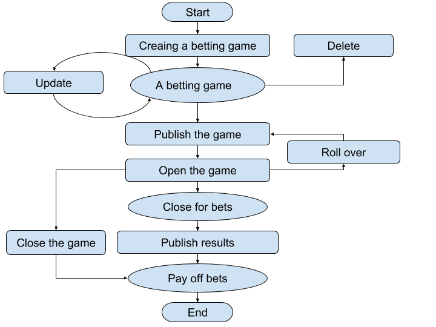
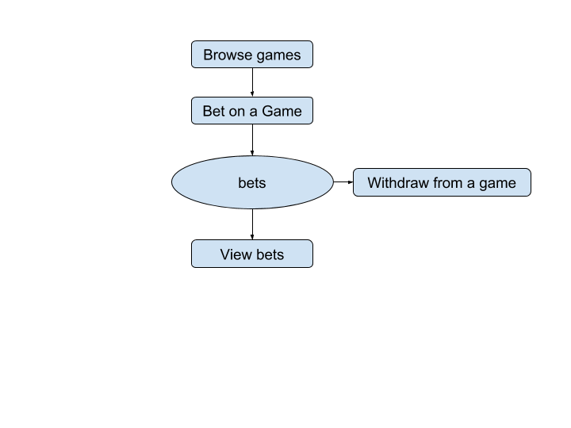

# Business Logic

**Disclaimer**: The business logic described here has a loop hole. It assumes that
the site has infinite credits;

**Disclaimer**: The business logic described here is not complete;

## Single Game Flow
### For Administrators



### For Common Users



## Use-Case Based Flow

### Current Design

#### Server Resonsibilities

The current design is that we only use `GET` and `POST`. If something is wrong, the server will respond with `“400 Bad Request”`. Otherwise the server will respond with `“200 OK”`. The detailed status is determined by the response body.

All API end points are started with *api/*. This document will omit this.

#### Server responses

The server should always respond with `ServerResponse`. the requested data is stored to data.

```protobuf
import "google/protobuf/any.proto";
message Error {
    enum ErrorCode {
        OK = 0;
        FOBBIDDEN = 1;
        UNAUTHORIZED = 2;
        NOT_FOUND = 3
        INVALID_DATA = 4;
    }

    ErrorCode error_code = 1;
    string error_message = 2;
}

message ServerResponse {
    Error error = 1;
    repeated google.protobuf.Any data = 2;
}
```

#### Things in Common

1. If a non-admin user tries to do admin's actions, the server should reject it and the `error_code` should be set to `FORBIDDEN`;
2. If an unauthorized user tries to do sensitive operation, the server should reject it and the `error_code` should be set to `UNAUTHORIZED`;
3. if a resource can not be found, the `error_code` should be set to `Not_FOUND`;
4. If the request data is invalid, the `error_code` should be set to `INVALID_DATA`;

### Administrators

#### Creating/Updating Games

**URL**: games/create_or_update

**HTTP Verb**: POST

**Protobuf**:

```protobuf
// common
message BettingOption {
    int32 id = 1;
    float odds = 2;
    string name = 3;
}

// request
message GameRequest {
    int32 id = 1;
    string name = 2;
    string description = 3;
    uint32 max_bet_options = 4;
    int32 bet_min = 5;
    int32 bet_max = 6;
    string endtime_for_bet = 7;
    repeated BettingOption betting_options = 8;
}

// response
message Game {
    int32 id = 1;
    string name = 2;
    string description = 3;
    uint32 max_bet_options = 4;

    enum Status {
        DRAFT = 0;
        PUBLISHED = 1;
    }

    Status status = 5;
    int32 bet_min = 6;
    int32 bet_max = 7;
    string endtime_for_bet = 8;
    repeated BettingOption betting_options = 9;
    int32 winningoption_id = 10;
    uint32 enrolled = 11;
}
```

**Details**:

1. Set `id` field of `GameRequest` to `-1` to create a game. Otherwise the server will modify existing games;
2. All fields of the `GameRequest` are required;
3. `name` and `odds` of `BettingOption` must come in pairs;
4. When creating a `Game`, `BettingOption` of the `GameRequest` must not contain the `id` field;
5. `max_bet_options` must be smaller than the number of `BettingOption`
6. When updating a `BettingOption` of an existing `Game`, the `id` field must be supplied with other fields;
7. When adding a `BettingOption` to an existing `Game`, the `id` field must not be set to -1; 
8. When removing a `BettingOption` from an existing `Game`, the `id` field must be supplied and the `odds` must be set to `0`;

9. Only `DRAFT` `Game` can be updated. The `error_code` should be set to `FORBIDDEN` when admin tries to update `Game` with `PUBLISHED` status;

#### Reading Games

**URL**: games/ 

**HTTP Verb**: GET

**Details**:

1. Current implementation get all games at one request;

#### Deleting Games

**URL**: games/delete/

**HTTP Verb**: POST

**Protobuf**:

```protobuf
message SingleEntryRequest {
    int32 id = 1;
}
```

**Details**:

1. The server should delete related `BettingOption`;
2. Only `DRAFT` `Game` can be deleted. The `error_code` should be set to `FORBIDDEN` when admin tries to delete `Game` with `PUBLISHED` status;

#### Publishing Games

**URL**: games/publish/

**HTTP Verb**: POST

**Protobuf**: the same as deleting games

#### Rolling Back Games

**URL**: games/rollback/

**HTTP Verb**: POST

**Protobuf**: the same as deleting games

**Details**:

1. The server should immediately change the `Game` status to `DRAFT` and notify the background worker to rollback all bets;

#### Publishing Result/ Closing Games

**URL**: games/settle

**HTTP Verb**: POST

**Protobuf**:

```protobuf
message GameSettleRequest {
    int32 id = 1;
    int32 winning_option_id = 2;
}

// Response: the same as creating the game
```

**Details**:

1. The server should notify the background worker to pay off all bets;
2. Set the `winning_option_id` to `-1` to close the game. Otherwise the `winning_option_id` must be valid;

#### Reading Bets

**URL**: bets/ 

**HTTP Verb**: GET

**Protobuf**:

```protobuf
// response
message BetAdmin {
    int32 id = 1;
    int32 user_id = 2;
    int32 betting_option_id = 3;
    int32 betted = 4;
    string created = 5;
    int32 earning = 6;
}
```

**Details**: 

1. the mechanism is the same as reading the games

### Common Users

#### Reading Games

**URL**: games/

**HTTP Verb**: GET

**Details**:

1. The server should reject common users accessing `DRAFT` games;

#### Betting on Games

**URL**: bets/bet

**HTTP Verb**: POST

**Protobuf**:

```protobuf
// request
message BetRequest {
    int32 betting_option_id = 1;
    int32 betted = 2;
}

// response
message Bet {
    int32 id = 1;
    int32 betting_option_id = 2;
    int32 betted = 3;
    string created = 4;
}
```

1. Server should first check the `endtime_for_bet`. If the time has passed, the server should reject bets;
2. Users must have sufficient credits;
3. betted credits must be in the range from `bet_min` and `bet_max`;
4. Server should update related counters;

#### Reading All unsettled Bets

**URL**: bets/unsettled

**HTTP Verb**: GET

**Protobuf**: the same as betting on games

**Details**:

1. Users can only accessing their own bets;
2. Current implementation returns all bets of the user;
