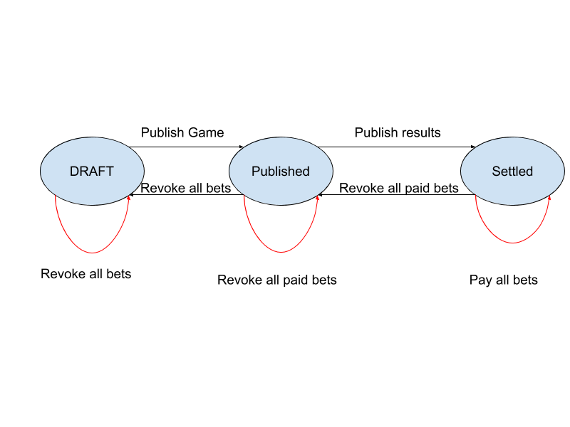

# Business Logic

**Disclaimer**: Pay attention to the Protobuf comment;

**Disclaimer**: The authorization process is not documented;

**Disclaimer**: The business logic described here has a loop hole. It assumes that the site has infinite money;

**Disclaimer**: The business logic described here is not complete.

## Design and Conventions

1. The current design does not depend much on HTTP semantics. The server currently only support GET and POST;
2. If something went wrong, the server will respond with "400 Bad Request". Otherwise the server will always respond with "200 OK";
3. The detailed status is determined by the error_code of the response body;
4. Protobufs ended with "Request" are used by clients to make requests, Protobufs ended with "Reply" are used by server to make responses;

### Common

#### Structure of the game

We will use this protobuf message for most of the heavy lifting job.

```protobuf
message Game {
  // The unique id for the game.
  // In request, set to -1 to create a new game, otherwise it will update the existing game with same id.
  // In response, server will always attach the id.
  int32 id = 1;

  // The name of the game.
  string name = 2;

  // The description of the game.
  string description = 3;

  // If true, normal user can see and bet on it.
  bool normal_user_visible = 4;

  enum Status {
    // The game is draft or **cancelled**.
    // This is also one of the final status of the game.
    DRAFT = 0;

    // The game is published.
    // All users can see and bet on it if not banned.
    // This is the only bet-able status.
    PUBLISHED = 1;

    // The game result is published and all money is settled.
    // This is one of the final status of the game.
    SETTLED = 2;
  }

  // Status of the game.
  // In request, this value will be ignored.
  // In response, it will return the current status.
  //
  // The valid status changes:
  // DRAFT -> PUBLISHED:
  //   This will set game.normal_user_visible to true.
  // PUBLISHED -> DRAFT:
  //   This will kick off worker to reimburse all the pending bets.
  // PUBLISHED -> SETTLED:
  //   If end_time_stamp_ms is in future, this will set it to be a time in the past.
  //   This will kick of worker to pay the rewards.
  // SETTLED -> PUBLISHED:
  //   This will kick of worker to revoke all the rewards.
  //
  // Special cases to trigger worker (to recover bad data):
  // DRAFT -> DRAFT:
  //   This will kick off worker to reimburse all the pending bets.
  // PUBLISHED -> PUBLISHED:
  //   This will kick of worker to revoke all the rewards.
  // SETTLED -> SETTLED:
  //   This will kick of worker to pay the rewards.
  Status status = 5;

  // Maximum number of bets one can made.
  // In most cases, this should be 1.
  uint32 maximum_bet_options = 6;

  // The least money one need to make a bet.
  int32 bet_money_least = 7;

  // The highest money one can bet.
  int32 bet_money_highest = 8;

  // The end time of the game in ms. Only before that, one can bet.
  int64 end_time_ms = 9;

  message BettingOption {
    // The odds of the betting option.
    // If the user payed 100 units on this bet options and wins,
    // the user will be rewarded with 100 * odds.
    float odds = 1;

    // The name of the betting option.
    string name = 2;
  }

  // All the betting options.
  repeated BettingOption betting_options = 10;

  // The zero-based winning option of the game.
  // The corresponding BettingOption is betting_options[winning_option].
  // The value is only available when the game status is SETTLED.
  int32 winning_option = 11;

  message Bet {
    int32 betting_option_id = 1;
    int32 money = 2;
  }

  // In request, this will be ignored.
  // In response, this will contain bets of requesting user.
  Bet bets = 12;
}
```

1. The `status` field change is crucial. The self to self status changes are used when something went wrong in the server, it will trigger the worker to process the remaining bets again.
2. `DRAFT` to `Settled`, `Settled` to `DRAFT` are prohibited;



2. betting_options` comes in order and we rely on the order to determine which option is winning;

#### Structure of Authorization

```protobuf
message AuthRequest {
  int32 uid = 1;
  string auth = 2;
  string saltKey = 3;
}

message AuthReply {
  enum ErrorCode {
    // No error.
    NO_ERROR = 0;

    // There's no user with such user id.
    NO_SUCH_USER = 1;

    // The user's auth and saltKey doesn't match the record.
    KEY_NOT_MATCHING = 2;

    // The user doesn't have the right permission to do so.
    PERMISSION_DENY = 3;
  }

  // The error code.
  ErrorCode error_code = 1;

  message User {
    int32 uid = 1;
    string name = 2;
  }

  // Information of the user.
  User user = 2;
}
```

## A Whirlwind of the Betting Game

### Creating/Updating a Game

**URL**: /api/bet/admin_game

**Protobuf**: `GameRequest` -> `GameReply`

```protobuf
// Changes properties of a game.
// URL: /api/bet/admin_game
// protobuf: GameRequest -> GameReply

message AdminGameRequest {
  AuthRequest auth = 1;
  Game game = 2;
}

message AdminGameReply {
  AuthReply.ErrorCode error_code = 1;
  Game game = 2;
}
```

**Details**

1. Set the `id` field of `Game` to `-1` to create a new game;
2. When modifying a `Game` the `id` must be valid;
3. Almost all fields are required, but leave the `normal_user_visible` and `status` field;
4. The server will ignore the `bets` field of the `Game`;

###  Change Status a Game

**URL**: /api/bet/admin_status

**Protobuf**: `AdminGameStatus` -> `AdminGameStatusReply`

```protobuf
// Changes status of a game.
// URL: /api/bet/admin_status
// protobuf: AdminGameStatusRequest -> AdminGameStatusReply

message AdminGameStatusRequest {
  AuthRequest auth = 1;

  // The id of game to be changed.
  int32 game_id = 2;

  // Sets the game status to be the desired status, and trigger necessary jobs.
  Game.Status game_status = 3;

  // Sets the winning_option of the game. This is only needed if game_status is set to settled.
  int32 winning_option = 4;
}

message AdminGameStatusReply {
  AuthReply.ErrorCode error_code = 1;

  enum ErrorCode {
    // No error.
    NO_ERROR = 0;

    // There's worker ongoing to change the user betting log. So this time, the modification failed.
    LOCKED = 1;

    // The status change is not one of the valid status change.
    INVALID_STATUS_CHANGE = 2;

    // The game status is setting to be SETTLED, but either:
    //   1) the winning_option is not specified.
    //   2) or the winning_option is out of range.
    INVALID_WINNING_OPTION = 3;
  }

  ErrorCode game_status_error_code = 2;

  // The game after the change.
  Game game = 3;
}
```

**Details**:

1. This is the most important API. All operation will trigger the worker to start working and lock the game;

### Listing Games

**URL**: /api/bet/list_game

**Protobuf**: `ListGameRequest` -> `ListGameReply`

```protobuf
// Lists games.
// URL: /api/bet/list_game
// protobuf: ListGameRequest -> ListGameReply

message ListGameRequest {
  AuthRequest auth = 1;

  // If false:
  //  1) draft games won't be included.
  //  2) games with normal_user_visible == false won't be included.
  // ErrorCode.PERMISSION_DENY will be returned if the user doesn't have admin rights.
  bool is_admin_request = 2;

  // List all game of that status.
  Game.Status game_status = 3;
}

message ListGameReply {
  AuthReply.ErrorCode error_code = 1;

  // The games.
  repeated Game games = 2;
}
```

### Betting on Games

**URL**: /api/bet/bet
**Protobuf**: `BetRequest` -> `BetReply`

```protobuf
// Bets on game.
// URL: /api/bet/bet
// protobuf: BetRequest -> BetReply
message BetRequest {
  AuthRequest auth = 1;

  int32 game_id = 2;

  // Puts all the bets the user made.
  // Sets to an empty array to clear bets.
  repeated Game.Bet bets = 3;
}

message BetReply {
  AuthReply.ErrorCode error_code = 1;

  enum BetErrorCode {
    NO_ERROR = 0;

    // One of the money is too low.
    MONEY_TOO_LOW = 1;

    // One of the money is too high.
    MONEY_TOO_HIGH = 2;

    // More options than the limit is chosen.
    OPTION_TOO_MANY = 3;
  }

  BetErrorCode bet_error_code = 2;

  // Bets after made the request.
  // Will be the original bets if the change failed.
  repeated Game.Bet bets = 3;
}
```

